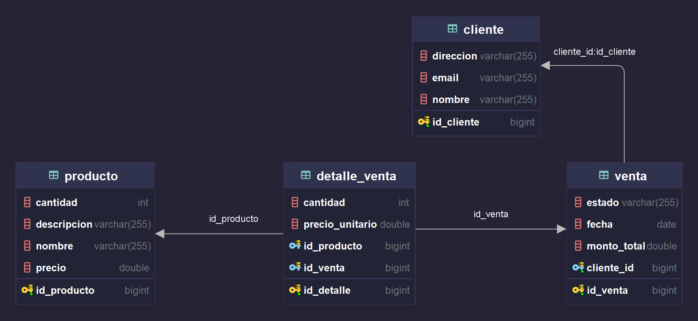

## RESTFUL

Operaciones básicas realizadas (crear, leer, actualizar, eliminar) y cómo interactúan con la base de datos.

[](https://app.getpostman.com/run-collection/19616140-b60dc1a0-fb5d-451c-8f5f-e7864f76dccc?action=collection%2Ffork&source=rip_markdown&collection-url=entityId%3D19616140-b60dc1a0-fb5d-451c-8f5f-e7864f76dccc%26entityType%3Dcollection%26workspaceId%3D323dac41-2fca-42b4-9c52-907c44e893ac)

## Consumo de API desde el Frontend

Implementación de una página que consume un servicio externo para normalizar direcciones.

### Servicio Externo

- URL del servicio: [http://servicios.usig.buenosaires.gob.ar/normalizar/](http://servicios.usig.buenosaires.gob.ar/normalizar/)
- Ejemplo de uso: `/api/normalizar/?direccion=${request}`
  ```
  ./
    └── api-frontend/
      └── src/
        └── app/
          └── page.jsx
  ```

## Preguntas de Git

### Descripción

Respuestas a las preguntas sobre Git relacionadas con manejo de branches, reversión de funcionalidades y deploy.

### Soluciones

- **Revertir Funcionalidad Pusheada:**

  1.  Asegurarme que tengo el ultimo contenido del repositorio remoto.

  ```bash
    git fetch
  ```

  2. Verificar el hash commit que quiero revertir

  ```bash
    git log
  ```

  3. Revertir el commit

  ```bash
    git revert <hash_commit>
  ```

  4. Hacer un nuevo commit y pushear los cambios revertidos

  ```bash
    git push origin <branch_name>
  ```

- **Deploy de la Versión v1.2.0:**
  Pasos para preparar y realizar el deploy de la versión `v1.2.0` en producción.

  1. Preparar codigo: Haber realizado pruebas y validado funcionalidad, ademas de haber actualizado todo tipo de configuracion.

  2. Asignar la version que se va deployar

  3. Preparar el entorno de produccion: Configuracion de servidor, base de datos, dependencias.

  4. Despliegue

  5. Actualizacion de documentación

## Consultas SQL

### Descripción

Resolución de consultas SQL específicas requeridas.



### Consultas

- **Productos sin Descripción:**

  ```sql
  SELECT * FROM producto WHERE nombre IS NOT NULL AND descripcion IS NULL ;
  ```

- **Productos Vendidos en las Últimas 24 Horas:**

  ```sql
  SELECT p.* FROM producto p
  JOIN detalle_venta dv ON p.id_producto
  JOIN venta v ON dv.id_venta =v.id_venta
  WHERE v.fecha >= now() - interval 1 day;
  ```

- **Recuento de Estados de Venta:**

  ```sql
  SELECT estado, COUNT(*) AS count
  FROM venta
  GROUP BY estado;
  ```

- **Comparacion de Gasto Mayor entre Cliente A y B:**
  ```sql
  SELECT c.email, SUM(v.monto_total) AS monto_total
  FROM venta v
  JOIN cliente c ON v.cliente_id=c.id_cliente
  GROUP BY c.email
  ORDER BY monto_total DESC
  ```
